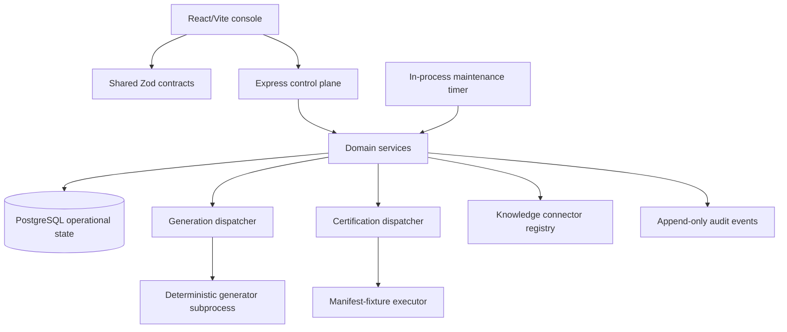
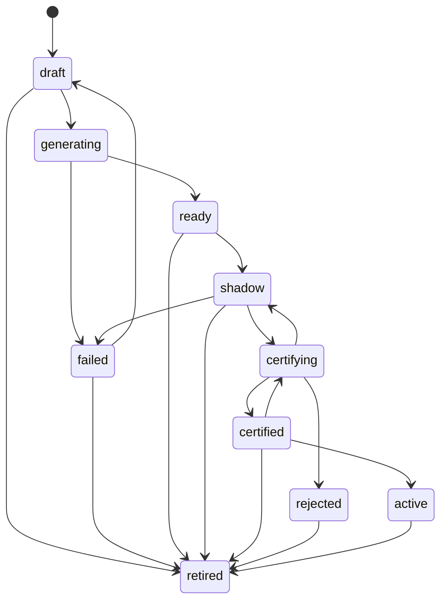
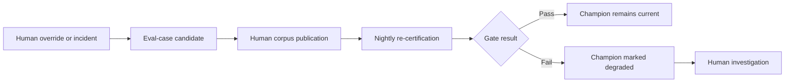

# Paul OS sanitized architecture brief

Baseline reviewed: Agent Builder commit `84cd1e5` (2026-08-16). This document describes behavior and
architecture without reproducing proprietary code, private source content, credentials, endpoints,
hostnames, or organization-specific identifiers.

## 1. Executive summary

The verified repository is not yet Paul OS. It is a production-minded, single-user **governed Agent
Builder** with:

- a React console for reuse-first agent specification, generation, library browsing, shadow
  evaluation, certification, and promotion;
- Zod-owned wire contracts and generated OpenAPI;
- an Express service layer over PostgreSQL/Prisma with actor attribution and append-only audit events;
- concrete agent families and sibling versions with champion/challenger lifecycle controls;
- deterministic first-party generation through an isolated subprocess;
- deterministic corpus-coverage certification, immutable gate/corpus versions, human promotion,
  evidence retention, and scheduled champion re-certification; and
- governed knowledge-source descriptors with fixture connectors and one opt-in, fail-closed,
  read-only analytical connector.

It does **not** currently contain a general skill registry, model-powered agent executor, context
assembler, project/protocol/tool registries, authority grants, production run ledger, durable
automation worker, outcome/metric system, durable memory, or incubator. There are no model calls in
the verified baseline. “Agent” currently means a governed versioned specification and generated
manifest, not a continuously operating autonomous runtime.

The numbered `00-core` through `12-agents` definitions added alongside this brief are sanitized
target seeds for the conversion. They must not be cited as evidence that those platform capabilities
already existed at the baseline commit. No separate Paul OS repository was available for extraction.

## 2. Current architecture

### Frontend

The single React application has browser routes for the builder, governed library, and concrete
agent certification. TanStack Query owns remote state; API responses are parsed through the shared
contracts. The builder supports guided and deterministic single-shot input, sequential section
confirmation, generation polling, shadow evaluation, and explicit promotion. MSW supplies tests.

### Contracts and API

Zod schemas are the wire-contract authority. OpenAPI is generated from registered schemas rather
than duplicated route comments. Static routes precede UUID-validated dynamic routes, and one
central middleware emits typed error envelopes with request IDs.

The API is agent-centric. Its resources cover catalog search, source descriptors, specifications,
generation jobs, shadow deployment, evaluations, certification runs, gate configurations, corpus
cases/versions, promotion, retirement, and recovery.

### Services and persistence

Services explicitly map storage records to validated domain responses. JSON columns are parsed at
write and read boundaries. PostgreSQL holds agent/version state, specifications, sources,
guardrails, generation jobs, evaluation cases/results, certification evidence, interpretation
lineage, promotion decisions, and audit events.

### Execution boundaries

Generation spawns a fixed first-party Node program with a fixed argument shape, no shell, bounded
output, timeout, limited concurrency, isolated temporary files, restricted subprocess environment,
and boot recovery. It produces a deterministic manifest; it does not execute the resulting agent.

Certification runs a deterministic manifest interpreter against an immutable corpus. It is labeled
`manifest_fixture` / `corpus_coverage`: scores measure fixture coverage agreement, not semantic model
reasoning or live answer quality.

### Operations and security

The backend defaults to loopback and can require a bearer token with a configured actor. Requests
carry IDs and actor context. Sensitive header fields are redacted from structured logs. Live
connectors are opt-in and fail closed. Containers are non-root, PostgreSQL migrations are separated
from runtime startup, and CI covers formatting, linting, strict TypeScript, tests, builds, migrations,
OpenAPI, and container smoke behavior.

## 3. Repository responsibility map

### Verified baseline

| Area                 | Actual responsibility                                                                               |
| -------------------- | --------------------------------------------------------------------------------------------------- |
| `apps/frontend`      | Builder, library, certification UI, API hooks, responsive instrument-style presentation             |
| `apps/backend`       | HTTP control plane, configuration, services, connector seams, dispatchers, maintenance, persistence |
| `apps/generator-cli` | Deterministic spec-to-manifest compiler invoked as a subprocess                                     |
| `packages/contracts` | Zod schemas, inferred types, state transition tables, route constants, generated OpenAPI            |
| `.github`            | Pull-request verification, image publication, dependency update automation                          |
| root configuration   | npm workspace, Compose, TypeScript/ESLint/Prettier, environment template and operator guidance      |

There was no root `CLAUDE.md`, `.claude`, `.runtime`, numbered content tree, or Paul OS skill/agent
runtime at the baseline commit.

### Numbered target taxonomy

| Directory             | Target definition responsibility                            | Baseline implementation status                           |
| --------------------- | ----------------------------------------------------------- | -------------------------------------------------------- |
| `00-core`             | Platform policy and sanitized profile template              | Missing; introduced as target content                    |
| `01-context`          | Context precedence, budgets and provenance policy           | Missing                                                  |
| `02-skills`           | Typed reusable capability definitions                       | Missing                                                  |
| `03-projects`         | Exact resource selection and scoped overlays                | Missing                                                  |
| `04-automation`       | Schedule/trigger definitions                                | Missing except platform maintenance timer                |
| `05-reference`        | Immutable static artifacts                                  | Missing as a governed resource                           |
| `06-business-domains` | Domain ownership, vocabulary and mandatory policy           | Implicit department strings only                         |
| `07-protocols`        | Versioned enforceable cross-cutting rules                   | Implicit in services and guardrails                      |
| `08-knowledge`        | Governed source descriptors and connector capability policy | Partially implemented in agent-specific storage/services |
| `09-evaluations`      | General corpora, executors, gates and evidence              | Implemented only for agent versions                      |
| `10-metrics`          | Metric definitions and time-series samples                  | Missing; only operational/evaluation fields exist        |
| `11-incubator`        | Observations, candidates, experiments and proposed patches  | Missing                                                  |
| `12-agents`           | General agent definitions and execution roles               | Partially implemented as builder-specific versions/specs |

Folder names are not runtime routing. The compiler must validate their manifests; application code
remains in a small workspace graph.

## 4. Runtime lifecycle

### Startup today

1. Environment values are parsed and cross-field constraints are validated.
2. Logger, Prisma client, services, dispatchers, connector registry, and maintenance are composed.
3. Persisted generation and certification jobs interrupted in a running state are failed and their
   owning resources are moved to recoverable states.
4. Queued jobs are reloaded into bounded in-process dispatchers.
5. Boot maintenance deletes expired unattached interpretations and compacts eligible old
   non-promotion evidence.
6. The HTTP server binds. Scheduled maintenance is armed when enabled.
7. Shutdown stops new maintenance scheduling, drains HTTP within a deadline, then disconnects the
   database. Interrupted jobs rely on boot recovery.

This is application startup, not a user-session startup. There is no session envelope, active
project resolution, profile loader, context budget computation, or skill index.

### Context loading today

Context is assembled ad hoc from request bodies, stored specifications, source descriptors, and
service configuration. Agent generation snapshots the complete specification. Certification
snapshots the subject, optional champion, corpus, gate configuration, and manifests. These are good
lineage practices, but they do not form a general context subsystem or precedence model.

### Task routing today

HTTP method/path selects a route, Zod validates input, and the route calls an injected service.
Dispatchers route queued generation/certification work by persisted job ID. The UI routes users
between three pages. There is no intent router selecting among skills or agents.

### Skill discovery and invocation today

No skill resource exists, so no skill discovery or invocation occurs. Service methods, the
generator, heuristic interpreter, connector interfaces, and certification executor are code-level
capabilities, not governed skills.

### Agents versus skills today

Only agents are modeled. A concrete agent is a family version with purpose, lifecycle, specification,
manifest, governed sources, policies, evaluations, and lineage. It is generated and certified but is
not invoked against real work. Therefore there is no current objective distinction in implementation;
“skill” is simply absent.

### Protocol effect today

Protocols are embedded rules: state-transition maps, request validation, generation gates,
connector restrictions, promotion checks, audit calls, and database constraints. They affect
execution, but cannot be enumerated, versioned, composed, or pinned as protocol resources.

### Context, knowledge, and reference today

- **Context:** transient request/service data and immutable job snapshots; no first-class envelope.
- **Knowledge:** registered descriptors associated with agents; credentials and arbitrary identifiers
  remain server-side. One provider can perform bounded read-only preview; other providers are typed
  fixtures/seams.
- **Reference:** not a first-class resource. Static guidance exists only as source-controlled docs,
  prompts, fixtures, and code constants.

### Projects today

There is no project model or overlay. Department labels group agents but do not select resource
versions, scope memory, or form an authority boundary.

### Deterministic versus model-driven

| Behavior                                                                           | Classification                                  |
| ---------------------------------------------------------------------------------- | ----------------------------------------------- |
| Contract validation, state transitions, similarity samples, single-shot heuristics | Deterministic                                   |
| Spec-to-manifest generation                                                        | Deterministic first-party subprocess            |
| Shadow evaluation fixtures and corpus certification                                | Deterministic                                   |
| Promotion, retirement, corpus/config publication                                   | Human-initiated and deterministically validated |
| Source retrieval when a live connector is explicitly enabled                       | External I/O under deterministic policy         |
| LLM reasoning, tool planning, semantic agent execution                             | Not implemented                                 |

### Actual lifecycle classification

| Transition                          | State                       | Evidence                                                                                         |
| ----------------------------------- | --------------------------- | ------------------------------------------------------------------------------------------------ |
| Signal → Observation                | MISSING                     | A source may be labeled as a signal, but no observation resource or ingestion transition exists. |
| Observation → Candidate improvement | MISSING                     | No observation/candidate model or service exists.                                                |
| Candidate improvement → Incubator   | MISSING                     | No incubator or experiment ledger exists.                                                        |
| Incubator → Skill                   | MISSING                     | No skill resource exists.                                                                        |
| Skill → Evaluation                  | MISSING                     | Evaluation subjects are concrete agent versions only.                                            |
| Evaluation → Promotion              | PARTIALLY IMPLEMENTED       | A passing, fresh agent certification run can support human promotion.                            |
| Promotion → Agent                   | IMPLEMENTED, AGENT-SPECIFIC | A certified challenger can become its family champion atomically.                                |
| Agent → Automation                  | MISSING                     | Agents have no production execution or schedule contract.                                        |
| Automation → Production execution   | MISSING                     | Nightly maintenance is platform upkeep, not user workload execution.                             |
| Production execution → Outcome      | MISSING                     | No general run or outcome record exists.                                                         |
| Outcome → Measurement               | MISSING                     | Evaluation scores/job progress are not outcome metrics.                                          |
| Measurement → Learning              | MISSING                     | No metric-triggered observation or learning loop exists.                                         |

The implemented agent path is instead:

## 5. Skill lifecycle

There is no current skill schema, registry, lifecycle, evaluation history, or invocation API. The
closest code-level analogue is an interface plus implementation selected during service composition,
but it has no durable identity or governance metadata.

| Skill field               | Explicit today? | Closest current analogue or gap                           |
| ------------------------- | --------------: | --------------------------------------------------------- |
| ID, name, purpose, owner  |              No | Code symbol/package metadata only                         |
| Version                   |         Partial | Generator and executor versions exist, not skill versions |
| Inputs and outputs        |         Partial | Zod contracts exist for API/service capabilities          |
| Dependencies              |              No | npm/module imports are implementation dependencies        |
| Tools and permissions     |              No | Connector/server policy is hard-coded or configured       |
| Context requirements      |              No | Service callers assemble data ad hoc                      |
| Success criteria          |         Partial | Tests and certification gates exist for agents            |
| Evaluation suite/history  |              No | Only agent-version corpora/runs exist                     |
| Status and maturity       |              No | No skill lifecycle                                        |
| Provenance/change history |         Partial | Git provides code history; no skill record                |
| Rollback version          |              No | No skill release pointer                                  |

The target daily-brief manifest illustrates the intended minimum schema: stable identity, semantic
version, purpose/owner, lifecycle/provenance, exact dependencies, JSON-schema-like I/O, tools,
permissions, context requirements, and success criteria. It is a target definition, not evidence of
baseline execution.

## 6. Agent lifecycle

### What an agent is today

An agent is a combination of:

- a stable family and versioned sibling row;
- human-authored outcomes, knowledge, guardrails/workflow, and output criteria;
- a deterministic generated manifest;
- governed knowledge-source relationships and guardrails;
- shadow evaluation fixtures;
- corpus certification evidence and promotion lineage; and
- lifecycle/audit metadata.

It is not currently a model prompt, reusable skill collection, scheduled process, persistent role
session, tool-running loop, or live production executor.

### Current agent fields

| Concern                                    | Current state                                                            |
| ------------------------------------------ | ------------------------------------------------------------------------ |
| ID/name/purpose/owner/department           | Explicit                                                                 |
| Family/version/slug/predecessor/derivation | Explicit                                                                 |
| Status/maturity                            | Explicit lifecycle state and certification health                        |
| Inputs/outputs                             | Defined indirectly by the four-section spec and manifest                 |
| Knowledge/context                          | Governed source descriptors; no general context policy                   |
| Guardrails/permissions                     | Explicit policies and approvals; no general tool registry                |
| Skills                                     | Missing                                                                  |
| Tools                                      | No first-class tool composition                                          |
| Execution loop/schedule                    | Missing                                                                  |
| Success criteria/evaluation                | Explicit acceptance tests, corpus results, gates                         |
| Provenance/change history                  | Spec revisions, interpretation confirmations, predecessor lineage, audit |
| Rollback                                   | Retirement/recovery exist; no production release rollback                |

### Current state machine

Architecturally, an agent should remain the operational composition defined in ADR 0003. A skill
should remain independently invocable, typed, bounded, and free of a persistent objective or loop.

## 7. Evaluation architecture

### Implemented

- Evaluation cases have immutable published corpus snapshots and provenance.
- Certification runs snapshot the subject, optional champion, manifests, corpus, gate configuration,
  generator, and executor identity.
- Challenger cases can compare champion and challenger on identical fixture input.
- Gate thresholds are stored in immutable, actor-published configurations.
- Run states are persisted and dispatched with bounded concurrency and restart recovery.
- Failed cases are available for review; older non-evidence detail can be compacted while summaries
  remain.
- Promotion evidence is retained permanently.
- Nightly champion re-certification can mark certification health degraded without changing the
  active lifecycle state.

### Limitations

- Subjects are agent versions only.
- `manifest_fixture` resolves known manifest evaluation fixtures. It measures coverage agreement,
  not semantic answer quality.
- There is no live model executor, tool-use evaluation, cost/latency gate, production replay, or
  outcome-history gate.
- Shadow deployment creates fixture evaluation rows; it does not shadow real production traffic.

## 8. Promotion architecture

### Stages that exist

| Desired stage | Closest current state                            | Assessment                                    |
| ------------- | ------------------------------------------------ | --------------------------------------------- |
| Experimental  | Draft specification / unconfirmed interpretation | Partial                                       |
| Candidate     | Generated ready/shadow version                   | Partial                                       |
| Evaluated     | Terminal certification run                       | Implemented for agents                        |
| Certified     | `certified` agent state                          | Implemented                                   |
| Production    | Active family champion                           | Governance pointer exists; execution does not |
| Deprecated    | `retired`                                        | Implemented                                   |

### Gates and approval

Promotion requires a human actor and rationale, a passing challenger run for the exact version, full
unpruned results, freshness, current corpus/configuration, unchanged subject and champion hashes,
and no prior decision. Promotion is serializable and atomic: the run becomes permanent evidence, a
decision/audit trail is written, the prior champion and superseded certified siblings retire, the
challenger activates, and the family champion pointer changes together.

There is no automated promotion. Direct state changes are constrained by services and database
invariants. Explicit retirement also requires a human rationale.

### Regression, rollback, observation, and failure

- Paired deterministic comparison prevents negative fixture regression for challengers.
- Scheduled champion re-certification detects drift against the latest corpus.
- Generation/certification failures are terminal job evidence and leave resources recoverable or
  reviewable.
- A rejected version is not edited; rework uses a successor.
- There is no atomic rollback to a prior production release because production execution/release
  pointers do not yet exist.
- There is no observation of real production outcomes.

## 9. Automation and self-improvement loop

### Recurring processes today

| Process                   | Trigger                             | Role in improvement                                                       |
| ------------------------- | ----------------------------------- | ------------------------------------------------------------------------- |
| Boot recovery             | Application start                   | Reaps interrupted jobs and resumes persisted queues                       |
| Maintenance               | Boot and configurable nightly timer | Deletes expired unattached interpretations and compacts eligible evidence |
| Champion re-certification | Nightly maintenance                 | Re-evaluates active champions against current corpus/configuration        |
| Dependency updates/CI     | Repository automation               | Checks dependency and code quality; not capability learning               |

Human users can add override/incident evaluation cases, deactivate cases, publish a new immutable
corpus, publish gate configuration, interpret a prompt, confirm spec sections, certify, promote, and
retire. No recurring process observes work, proposes a skill, changes code, tests a patch, or promotes
anything automatically.

### Current system

### Implied architecture emerging from the implementation

```mermaid
flowchart LR
    S[Run signal or feedback] --> O[Versioned observation]
    O --> I[Human-curated improvement candidate]
    I --> E[Sandboxed experiment]
    E --> V[Successor skill or agent version]
    V --> T[Contract and semantic evaluation]
    T --> H[Human certification and promotion]
    H --> R[Immutable release]
    R --> A[Bounded authority grant]
    A --> X[Scheduled or on-demand execution]
    X --> U[Outcome and metrics]
    U --> S
```

The target deliberately keeps model-generated learning advisory. It may create an observation or
proposed patch, never modify or promote a governed definition by itself.

## 10. State and memory model

### Persistent today

- agent families, versions, specs, manifests, sources, policies, and relationships;
- generation jobs and immutable spec snapshots;
- evaluation cases, published corpora, results, gate configurations, and certification runs;
- promotion decisions, lifecycle attribution, and append-only audit events;
- interpretation trees and section confirmations, with expiration for unattached drafts; and
- PostgreSQL data across restarts through the configured database/volume.

### Ephemeral today

- React component/query state;
- request context and actor binding;
- in-process semaphore queues around persisted job IDs;
- temporary generator directories and process output;
- connector caches/circuit state; and
- log streams.

There is no conversational memory, session record, accepted durable memory, project memory, context
envelope, or memory provenance model. Job snapshots are reproducibility evidence, not memory.

Human approval occurs at confirmation of interpreted sections, corpus/gate publication, promotion,
retirement, and explicit recovery operations. Generation and shadow actions are human-triggered but
do not use a reusable approval resource. The future authority envelope and staged-memory acceptance
are therefore new contracts.

## 11. Agent Builder integration surface

An external Agent Builder should depend on platform contracts rather than database tables.

| Platform contract         | Existing concept                                   | Formalization required                                                             |
| ------------------------- | -------------------------------------------------- | ---------------------------------------------------------------------------------- |
| Agent Registry API        | Family catalog, version detail, champion metadata  | General resource envelope and immutable release lookup                             |
| Skill Registry API        | None                                               | Full registry, version, dependency, invocation, evaluation contracts               |
| Evaluation API            | Agent corpus, cases, runs, gate results            | General subject version/bundle, semantic executor, cost/latency gates              |
| Promotion API             | Agent certification/promotion/retirement           | Release pointers, rollback and resource-kind-neutral evidence                      |
| Tool Registry             | Connector and subprocess code boundaries           | Stable tool IDs, typed I/O, scopes, risk/approval class, adapter versions          |
| Knowledge Source Registry | Agent source descriptors and capability interfaces | General ownership, freshness, access, project policy and retrieval contract        |
| Policy/Protocol Registry  | Guardrails and service rules                       | Versioned protocols, precedence, enforcement points and immutable pins             |
| Project/Context API       | None                                               | Profile/project selection, overlay validation, envelope preview and provenance     |
| Release/Compiler API      | Deterministic agent manifest generation            | Repository import, dependency closure, digest, release bundle and drift status     |
| Execution API             | Generation/certification jobs only                 | Production runs, events, steps, cancellation, idempotency and provider/tool events |
| Approval API              | Promotion rationale only                           | Authority grants, approval requests, revocation and budget consumption             |
| Automation API            | Maintenance timer only                             | Schedules, triggers, leases, retry/catch-up and authority matching                 |
| Observability API         | Logs, job progress, audit, evaluation counts       | Outcome, metrics, cost, latency, trace/event stream and sanitized diagnostics      |
| Incubator API             | Eval-case feedback seam                            | Observations, candidates, experiments and proposed-patch review                    |

The builder should send stable descriptor/resource IDs only. The platform resolves credentials,
provider endpoints, database identifiers, tool implementations, and policy server-side.

## 12. Productization blockers

### Identity, tenancy, and authorization

- Authentication is optional and supports one configured actor rather than user accounts.
- There is no workspace/tenant boundary, membership model, RBAC, delegated approval role, or resource
  ownership enforcement.
- Audit attribution exists but does not establish identity assurance by itself.

### Configuration and deployment

- Configuration is process-wide environment state.
- A first-party executable path and local filesystem assumptions remain part of generation.
- The in-process maintenance scheduler and in-process dispatch triggering assume a small deployment.
- PostgreSQL is required, but hosted deployment topology, backup/restore, and regional policy are not
  productized.
- The real private profile location, encryption, backup, and device migration require explicit
  operational ownership.

### Provider and connector coupling

- The source/provider enum and seeded descriptors are centrally compiled rather than dynamically
  registered.
- Only one live analytical connector is implemented; other integrations are capability seams or
  fixtures.
- There is no general tool permission registry or per-user credential broker.
- There is no model provider abstraction or model call in the baseline.

### State and contracts

- Core storage is agent-specific rather than a common resource registry.
- No context/profile/project configuration schema is active at runtime.
- No production execution, authority envelope, outcomes, metrics, memory, observation, or incubator
  API exists.
- The current API prefix and frontend assume Agent Builder as the whole product.

### Observability and operations

- Structured request/job logging and audit evidence are strong, but there is no distributed trace,
  per-run cost accounting, outcome telemetry, SLO model, or operator console.
- In-process queues use persisted IDs and recovery but are not a horizontally scalable worker lease
  system.
- Full browser end-to-end coverage and state backup/restore rehearsal are not present.

### Public-repository sanitization

- Existing branding and fixture identifiers require a deliberate neutralization pass.
- Secret scanning must cover history, examples, private profile patterns, generated output, and
  source identifiers—not merely committed `.env` files.
- Public fixtures must remain synthetic and must not preserve confidential prompts or data shapes
  that reveal private operations.

## 13. Architectural inconsistencies

1. **Active is governance, not execution.** An active champion has no production runner or outcome
   stream, so “production” currently denotes selection rather than service.
2. **Agent is over-broad and under-active.** It owns specification/evidence but neither composes
   skills nor runs an execution loop.
3. **Shadow is synthetic.** Shadow deployment creates fixture results rather than observing mirrored
   production traffic.
4. **Policies are split.** Guardrails are data, while important security/state rules live in code and
   database constraints with no versioned protocol identity.
5. **Knowledge and context blur at service boundaries.** Source descriptors are governed, but there
   is no explicit context envelope explaining what was included, omitted, or budgeted.
6. **Maintenance is the only scheduler.** Its reliability pattern suggests automation, but it is not
   a general workload scheduler and should not be presented as one.
7. **Deterministic generation can be mistaken for agent execution.** It builds a manifest only.
8. **Certification terminology can overstate evidence.** The UI disclaimer correctly limits fixture
   scores; all downstream contracts must preserve executor/evaluation-mode stamps.
9. **Department is a label, not a domain boundary.** It provides neither inherited policy nor access
   control.
10. **Git history is too thin to provide resource provenance alone.** Imported canonical digests and
    explicit source commits are still necessary.

## 14. Missing contracts

The following contracts are required before the target architecture can be considered operational:

- common resource family/version, immutable import, dependency closure and release bundle;
- compiler diagnostics, canonical digest, frozen-version conflict and repository drift;
- profile, project overlay, context item/envelope and token-budget explanation;
- skill invocation and typed result;
- tool descriptor, scope, approval class, idempotent effect, cancellation and sanitized error;
- model provider stream, structured output, usage, pricing version, budget and failure taxonomy;
- production run/event/step/outcome and retry/cancellation semantics;
- authority grant, approval request, consumption, escalation, expiry and revocation;
- automation schedule/trigger, lease, heartbeat, catch-up, deduplication and retry;
- memory proposal, acceptance/rejection and provenance;
- metric definition/sample, cost, latency and outcome quality;
- observation, improvement candidate, experiment and proposed patch;
- generalized evaluation subject, semantic result, release promotion and rollback; and
- user/workspace identity, role, ownership and policy scope before multi-user operation.

## 15. Questions requiring human architectural decisions

These are deliberately not answered by the current implementation:

1. Which private-profile backup location and recovery policy is acceptable for the local user?
2. Which real workflow follows the synthetic daily briefing, and what measurable outcome defines its
   value?
3. Which tools may ever receive standing authority, and which always require per-run approval?
4. What cost ceilings and notification behavior should apply when an authority grant is nearly
   exhausted?
5. What evidence is sufficient to move from deterministic contract coverage to semantic
   certification?
6. Which memory categories may become durable, how long are they retained, and who may correct them?
7. At what deployment stage is a real external scheduler/queue required instead of PostgreSQL worker
   leases?
8. What identity provider, workspace isolation, and RBAC model are required before inviting a second
   user?
9. Which gateway/provider policy is required in a restricted work environment, and who certifies the
   adapter?
10. What compatibility date triggers removal of the agent-specific API after `/v1` parity?

## Capability baseline

| Capability                 | Current State                                   | Evidence                                      | Maturity               | Target Contract Needed       |
| -------------------------- | ----------------------------------------------- | --------------------------------------------- | ---------------------- | ---------------------------- |
| Agent catalog/versioning   | Family, sibling versions, champion selection    | Catalog, lineage and lifecycle records        | Production-shaped      | Common Resource Registry     |
| Guided agent specification | Four validated, revisioned sections             | Spec endpoints and completion gates           | Mature scaffold        | `/v1` Agent Definition       |
| Single-shot specification  | Deterministic prefill with confirmation lineage | Interpretation records and explicit saves     | Functional scaffold    | Interpreter Adapter          |
| Agent generation           | Deterministic isolated subprocess               | Persisted job, snapshots, manifest            | Mature scaffold        | Compiler/Release API         |
| Skill registry             | Not present                                     | No skill model or invocation                  | Missing                | Skill Registry/Invocation    |
| Agent execution            | Not present                                     | No provider/tool run loop                     | Missing                | Execution Run/Event/Outcome  |
| Model provider             | Not present                                     | No model calls                                | Missing                | Provider Stream/Usage        |
| Knowledge registry         | Agent-bound descriptors and connector seams     | Read-only descriptor validation               | Partial                | General Knowledge Registry   |
| Context assembly           | Ad hoc request and snapshot assembly            | No session envelope or precedence engine      | Missing                | Context Envelope API         |
| Projects                   | Department labels only                          | No project resource or overlay                | Missing                | Project Registry             |
| Protocols/policies         | Guardrails plus code/database rules             | Enforcement exists without versioned protocol | Partial                | Protocol Registry            |
| Tool registry              | Code-level adapters only                        | No stable typed permissioned tool resource    | Missing                | Tool Registry                |
| Evaluation corpus          | Immutable agent corpus versions                 | Published snapshots and cases                 | Strong, agent-specific | General Evaluation API       |
| Certification              | Deterministic champion/challenger runs          | Gate results and executor stamps              | Strong scaffold        | Semantic/General Subject API |
| Human promotion            | Atomic, evidence-bound champion swap            | Decision, audit and DB invariants             | Strong, agent-specific | Release Promotion/Rollback   |
| Production rollback        | Retirement/recovery only                        | No prior release pointer swap                 | Missing                | Release Rollback API         |
| Automation                 | Platform maintenance timer only                 | Nightly upkeep and re-certification           | Partial infrastructure | Automation/Lease API         |
| Authority grants           | Promotion rationale only                        | No reusable bounded execution authority       | Missing                | Grant/Approval API           |
| Audit trail                | Actor-attributed append-only events             | Lifecycle/service audit writes                | Strong single-user     | Workspace-aware Audit API    |
| Runs and outcomes          | Generation/certification jobs only              | Progress and terminal evidence                | Partial                | General Run/Outcome API      |
| Metrics and cost           | Scores/counts/timestamps only                   | No metric definitions or provider spend       | Missing                | Metrics API                  |
| Durable memory             | Not present                                     | Job snapshots are evidence, not memory        | Missing                | Memory Proposal API          |
| Incubator                  | Not present                                     | Feedback can become eval cases manually       | Missing                | Observation/Experiment API   |
| Self-improvement           | Human corpus feedback plus nightly drift check  | No autonomous proposal/change loop            | Partial seam           | Learning Candidate API       |
| Authentication             | Optional bearer identity                        | One configured actor                          | Local-only             | Identity/RBAC                |
| Tenancy                    | Single global installation                      | No workspace boundary                         | Missing                | Workspace Isolation          |
| Operational recovery       | Job reaping/resume and graceful shutdown        | Boot dispatch recovery                        | Good single-process    | Worker Lease/Heartbeat       |
| OpenAPI/contracts          | Zod-generated and tested                        | Served document and equality tests            | Strong                 | Extend to `/v1` resources    |
