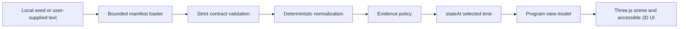

# AIM Repository Integration Notes

Status: grounded against the active Paul OS worktree on 2026-08-17.

## Baseline

AIM is integrated into the existing application. It is not a second application, data plane, or design system. The source visualization handoff is treated as a product specification only; no prior prototype code or protected geometry is imported.

| Concern                | Repository reality                                                                                                                     | AIM placement                                                                           |
| ---------------------- | -------------------------------------------------------------------------------------------------------------------------------------- | --------------------------------------------------------------------------------------- |
| Application framework  | React 19.1, Vite 6.4, strict TypeScript 5.8                                                                                            | `apps/frontend/src/features/aim/`                                                       |
| Routing                | React Router 7 `createBrowserRouter`; routes are lazy children of `PlatformShell`                                                      | Feature-gated `/aim` child route in `apps/frontend/src/router.tsx`                      |
| Server state           | TanStack Query 5; browser traffic uses HTTP contracts                                                                                  | AIM Phase 1 is local/offline and does not bypass the `/v1` boundary                     |
| Validation             | Zod 3.24 in the shared contracts package                                                                                               | `packages/contracts/src/aim/`                                                           |
| Pure domain logic      | Browser-neutral code already belongs in `@paul-os/runtime`                                                                             | Browser-safe `@paul-os/runtime/aim` subpath                                             |
| 3D                     | Direct Three.js is pinned locally; React Three Fiber is not installed                                                                  | A thin lifecycle wrapper under the existing frontend feature                            |
| Existing visualization | `StarfieldCanvas` and blueprint UI use explicit canvas lifecycle, capped rendering work, and reduced-motion handling                   | Reuse those lifecycle and accessibility conventions, not their business state           |
| Feature flags          | Small typed environment reader                                                                                                         | `VITE_AIM_ENABLED=true`; disabled unless explicitly enabled                             |
| Tests                  | Node tests for contracts; Jest for backend/worker; Vitest/RTL/MSW for frontend; Playwright for smoke flows                             | Pure contract/state tests in packages; route and rendering tests remain frontend-owned  |
| Build                  | npm workspaces and TypeScript project references                                                                                       | Root `npm run typecheck`, `npm test`, and `npm run build` include the existing packages |
| Deployment             | Docker Compose builds backend, worker, frontend, and PostgreSQL; CI checks formatting, lint, type safety, tests, builds, and Compose   | AIM has no additional service and no public runtime dependency                          |
| Design system          | Matte black base, purple decision accent, amber degradation, safety red, Aptos/Bahnschrift/Cascadia fallbacks, responsive shared shell | AIM uses the same tokens and shell; no remote fonts                                     |
| Authentication         | Requests resolve to a scoped `RequestPrincipal`; the console has no direct database path                                               | Future live AIM adapters must enter through governed `/v1` services                     |

## Existing domain relationships

- The numbered directories are Git-authored content, not npm workspaces.
- `03-projects/aim/program.seed.json` is the one synthetic Level 0 program definition.
- Existing registries, evaluations, evidence, and metrics can become future adapters, but Phase 1 does not invent links or query operational systems.
- No pre-existing AIM, capability-map, or manufacturing-roadmap module supplied reusable entity IDs. AIM therefore defines stable, versioned IDs inside its own manifest namespace.
- The checked-in seed contains only synthetic public data and neutral group labels. It contains no people, credentials, internal locations, raw source URIs, protected geometry, or authentic dimensions.

## Logical-to-physical module map

| Logical module               | Physical location                                                     | Notes                                                                        |
| ---------------------------- | --------------------------------------------------------------------- | ---------------------------------------------------------------------------- |
| Versioned contract and types | `packages/contracts/src/aim/program-contract.ts`                      | Strict Zod validator and relationship refinements                            |
| Portable JSON Schema         | `packages/contracts/src/aim/program.schema.json`                      | Draft 2020-12 artifact for non-TypeScript consumers                          |
| Seed program                 | `03-projects/aim/program.seed.json`                                   | Complete named anchor cast plus generic fallback regions                     |
| Loader and normalizer        | `packages/runtime/src/aim/program-loader.ts`, `program-normalizer.ts` | Offline, bounded, deterministic, non-logging                                 |
| Evidence policy              | `packages/runtime/src/aim/evidence-policy.ts`                         | Preserves source lifecycle/readiness and separately evaluates GO eligibility |
| Time projection and diff     | `packages/runtime/src/aim/state-at-time.ts`, `program-diff.ts`        | Pure `stateAt(T)` and QBR diff                                               |
| Renderer-facing model        | `packages/runtime/src/aim/program-view-model.ts`, `visual-state.ts`   | Contains derived material/readiness/tank/heartbeat fields only               |
| Level 0/1 source adapters    | `packages/runtime/src/aim/adapters/`                                  | Static and caller-supplied local text; no network or file-system authority   |
| Frontend scene and UI        | `apps/frontend/src/features/aim/`                                     | Consumes the browser-safe runtime subpath; must not contain business truth   |
| Feature flag                 | `apps/frontend/src/config/feature-flags.ts`                           | AIM route does not exist unless enabled                                      |

## Runtime boundary

The renderer never reads source records, computes lifecycle truth, opens evidence links, or substitutes visual state for evidence. `stateAt` does not mutate the manifest. Dynamic animation may demonstrate a decision-loop step only when `program.synthetic` is true; non-synthetic manifests require a future sourced workflow-state observation.

## Data and safety rules

- `schemaVersion` is exactly `aim.program/v1`. Unsupported versions fail visibly.
- Canonical relationships use stable lower-snake-case IDs. Labels remain mutable.
- Geometry resolution is exact anchor, alias, generic region, then clickable fallback node.
- Every fallback region must reference an anchor whose kind is `region`.
- Lifecycle and readiness are separate. A source may say `production` while the evidence gate still reports a warning.
- GO requires current evidence, required metrics, satisfied required criteria, and a non-conflicting, fresh status source.
- Evidence URIs are inert data. Runtime loaders never navigate or fetch them.
- Metrics and sources carry observation time, source reference, freshness, and confidence/reconciliation state.
- The seed must retain the visible text `CONCEPTUAL GEOMETRY — NOT VEHICLE CAD`.
- `stargate` is retained only as the required stable anchor ID for an abstract additive-printer proxy. It carries no authentic equipment geometry, dimensions, or routing.

## Editing program reality

1. Copy `03-projects/aim/program.seed.json` to a local working file.
2. Preserve stable IDs; edit labels and descriptions freely.
3. Append time-ordered status, metric, criterion, interface, and handoff observations instead of replacing history.
4. Add evidence and source records before referencing them.
5. Keep actual private material outside the public repository.
6. Load the text through `loadAimProgram`. Fix every returned issue before using it.
7. Use `serializeAimProgram` to produce a normalized, deterministic JSON representation.

The Level 1 adapter accepts text already selected by the user. Browser drag/drop and File System Access API orchestration belong in the frontend and must remain optional.

## Deferred source levels

- Level 2 deterministic CSV/work-item converters, reconciliation reports, and no-loss accounting.
- Level 3 governed composite service using exact `/v1` contracts.
- Level 4 event-backed updates.

None of these is represented as complete by the Level 0/1 loader.
