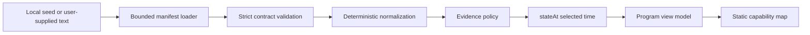

# AIM Repository Integration Notes

Status: grounded against the active Paul OS worktree on 2026-08-18.

## Baseline

AIM is part of the existing React application. It is not a second application, data plane, or
design system. The checked-in route is a static, read-only view of a validated local manifest.

| Concern      | Repository reality                     | AIM placement                                      |
| ------------ | -------------------------------------- | -------------------------------------------------- |
| Frontend     | React, Vite, strict TypeScript         | `apps/frontend/src/features/aim/`                  |
| Routing      | Lazy children of `PlatformShell`       | Feature-gated `/aim` child route                   |
| Validation   | Zod contracts and portable JSON Schema | `packages/contracts/src/aim/`                      |
| Domain logic | Browser-neutral runtime package        | Browser-safe `@paul-os/runtime/aim` subpath        |
| Source       | Sanitized local manifest               | `03-projects/aim/program.seed.json`                |
| Tests        | Vitest/RTL plus Playwright smoke flows | Route interaction and validation behavior          |
| Deployment   | Existing frontend service              | No additional service or public runtime dependency |

## Data flow

The interface never reads source records, computes lifecycle truth, opens evidence links, or
substitutes presentation state for evidence. `stateAt` does not mutate the manifest.

## Logical-to-physical map

| Logical module               | Physical location                                                     | Notes                                                        |
| ---------------------------- | --------------------------------------------------------------------- | ------------------------------------------------------------ |
| Versioned contract and types | `packages/contracts/src/aim/program-contract.ts`                      | Strict validation and relationship refinements               |
| Portable JSON Schema         | `packages/contracts/src/aim/program.schema.json`                      | Draft 2020-12 artifact                                       |
| Seed program                 | `03-projects/aim/program.seed.json`                                   | Synthetic groups, hardware, agents, connectors, and evidence |
| Loader and normalizer        | `packages/runtime/src/aim/program-loader.ts`, `program-normalizer.ts` | Offline, bounded, deterministic, non-logging                 |
| Evidence policy              | `packages/runtime/src/aim/evidence-policy.ts`                         | Separates source readiness from GO eligibility               |
| Time projection and diff     | `packages/runtime/src/aim/state-at-time.ts`, `program-diff.ts`        | Pure `stateAt(T)` and program diff                           |
| Runtime view model           | `packages/runtime/src/aim/program-view-model.ts`                      | Derived group, agent, manufacturing, and coverage facts      |
| Frontend view model          | `apps/frontend/src/features/aim/aim-view-model.ts`                    | Narrows runtime output to static UI facts                    |
| Frontend route and panels    | `apps/frontend/src/features/aim/`                                     | Group → hardware/method → agents/connectors → evidence       |

## Data and safety rules

- `schemaVersion` is exactly `aim.program/v2`; unsupported versions fail visibly.
- Canonical relationships use stable lower-snake-case IDs. Labels remain mutable.
- Every part has one canonical `ownerGroupId`; contract-required ownership relationships remain
  exclusive and bidirectionally valid.
- Primary groups are sorted by unique `displayOrder`; supporting groups participate but cannot own
  hardware.
- Part coverage stores agent and evidence references. Counts and evidence age are derived.
- Agent authority uses numeric tiers `0` through `4`, rendered as the established R0–R4 ladder.
- Public examples and connector marks remain explicitly synthetic.
- Lifecycle and readiness are separate. A source may report `production` while its evidence gate
  still warns.
- GO requires current evidence, required metrics, satisfied criteria, and a non-conflicting fresh
  status source.
- Evidence URIs are inert data. Runtime loaders never navigate or fetch them.
- The frontend labels connector access as declared reach and never presents it as live authority.
- Compatibility-only presentation metadata in the v2 contract is validated but not consumed by the
  current static interface.

## Editing program reality

1. Copy `03-projects/aim/program.seed.json` to a local working file.
2. Preserve stable IDs; edit labels and descriptions freely.
3. Keep part ownership and agent coverage relationships bidirectionally consistent.
4. Append time-ordered status, metric, criterion, interface, and handoff observations instead of
   replacing history.
5. Add evidence and source records before referencing them.
6. Keep private material outside the public repository.
7. Load the text through `loadAimProgram` and fix every returned issue before using it.
8. Use `serializeAimProgram` to produce a normalized, deterministic JSON representation.

## Deferred source levels

- Level 2 deterministic CSV/work-item converters, reconciliation reports, and no-loss accounting.
- Level 3 governed composite service using exact `/v1` contracts.
- Level 4 event-backed updates.

None of these is represented as complete by the Level 0/1 loader.
