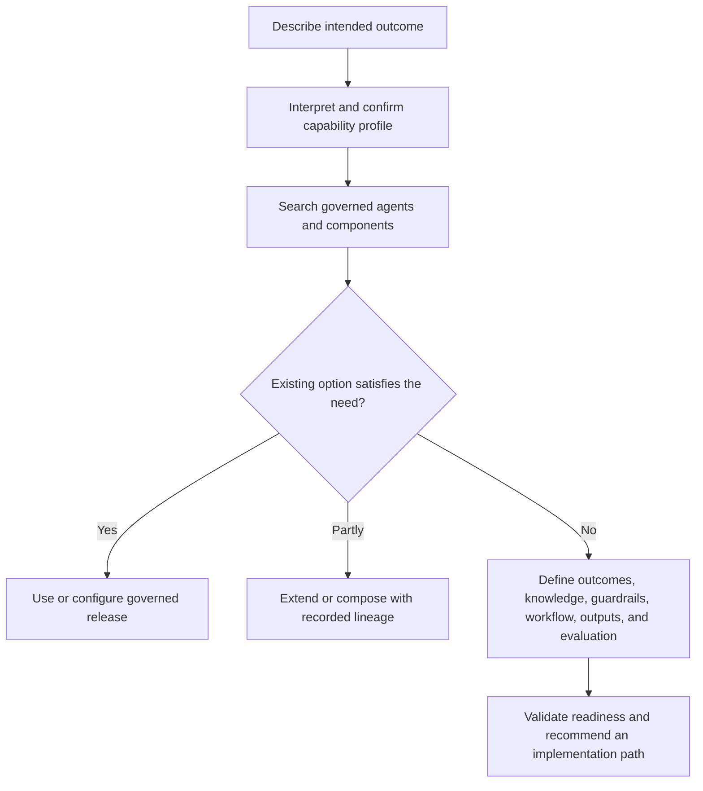

# Agent Builder Foundation — Sanitized Summary

## Purpose

The earliest Agent Builder concept established a reuse-first workflow. A user describes a job in
plain language, the platform interprets the intended outcome, and the catalog searches for governed
agents or components before allowing a new build. The product behaves like a controlled capability
configurator rather than a prompt-to-production shortcut.

This summary replaces an unstructured conversational source file. It preserves architectural intent
without retaining source-specific examples, proprietary terminology, or conversational history.

## Reuse-first intake

The intake derives a capability profile containing:

- Intended users and business domain
- Trigger and required tasks
- Expected output and success criteria
- Required knowledge classes and tools
- Potential actions and risk level

The user confirms this interpretation before any persistent specification is created. Catalog search
combines structured capability coverage with semantic similarity and returns exact matches, nearby
matches, reusable components, known limitations, ownership, and certification evidence.

For each referred choice, the user can:

- Use the governed release without modification
- Configure it through an allowed project overlay
- Extend it as a lineage-linked successor
- Continue with a new build when reuse does not satisfy the need

## Guided definition

When no reusable option is sufficient, the builder gathers a complete specification in ordered
sections:

1. **Outcomes** — the decision or work product, consumers, current baseline, and measurable quality
   and business targets.
2. **Knowledge** — authoritative records, analytical sources, static references, historical cases,
   transient context, ownership, freshness, access mode, and citation requirements.
3. **Guardrails** — scope, data, reasoning, action, approval, and fail-closed boundaries.
4. **Workflow** — stages, tool sequence, checks, retry and timeout behavior, escalation paths, and
   evidence requirements.
5. **Outputs** — a typed result contract rather than prose alone.
6. **Evaluation** — routine, difficult, adversarial, incomplete-data, permission, safety, and
   regression cases with explicit acceptance thresholds.

Connected knowledge is not assumed to be usable. The platform should identify missing ownership,
poor quality, conflicting definitions, stale material, absent lineage, inaccessible records, and
critical knowledge that has not been captured.

## Build recommendation

Only a validated specification can produce a recommendation. The platform may recommend reuse,
configuration, composition, extension, a new build, repair of an upstream process, or refusal when
the proposed workflow is unsafe or cannot be evaluated.

Catalog records therefore need more than a name. A governed resource includes identity, version,
purpose, capabilities, inputs and outputs, operating boundaries, dependencies, quality evidence,
known failure modes, configurable fields, extension points, lineage, and deployment history.

## Core flow

The central invariant is unchanged: discovery comes before generation, and generation never bypasses
explicit workflow definition, governed authority, or evaluation.
