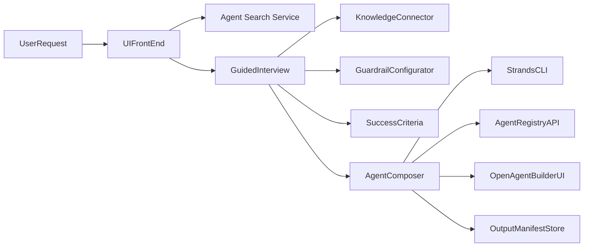

# Archived Open-Source Landscape Notes

> Historical research input retained for architectural context. Project capabilities, versions,
> licenses, and integration assumptions were exploratory and must be independently verified before
> adoption. This document contains no endorsement and is not the current Paul OS implementation
> specification.

## Executive Summary

We explored existing open-source agent-builder and agent-registry projects to see how they could be leveraged in our **governed, reuse-first Agent Builder platform**. Notably, projects like Firecrawl’s _Open Agent Builder_ and Strands’ _Agent Builder_ cover pieces of the puzzle (visual workflow editing and CLI-based agent construction, respectively), while registries like Solo’s _AgentRegistry_ and the AWS-funded MCP Gateway & Registry provide asset catalogs, metadata, and governance for agents, tools, and skills. AgentShelf offers a public directory of agent definitions (Markdown+YAML) that illustrates reusable “agent recipes.” However, **no single project implements the full vision**: a guided specification interview with domain knowledge, similarity-based reuse suggestions, an asset/skill graph, guardrails and approval gates, built-in evaluation tests, and automated deployment. Our platform will integrate best-of-breed components and add missing pieces (e.g. similarity search, evaluation harness, policy manager) into a coherent system.

Key findings:

- **Firecrawl Open Agent Builder (MIT)** is a drag-and-drop AI workflow designer with execution engine and templates, but lacks domain-specific guidance and enterprise reuse logic.
- **Strands Agent Builder (Apache-2.0)** is a CLI tool for creating and testing agents and tools, but has no multi-tenant UI or agent catalog.
- **Solo AgentRegistry (Apache-2.0)** and **Agentic/MCP Gateway & Registry (Apache-2.0)** offer unified catalogs of agents, skills, and tools with versioning, metadata, and secure deployment, but no guided builder UI or knowledge configuration.
- **Agent Shelf (CC BY-SA)** demonstrates the power of publishing agent definitions as shareable YAML/Markdown, but is a public marketplace without corporate governance or multi-step workflows.

In short, we must **compose and extend**: reuse existing registry/catalog backends and UI frameworks where possible, and build new modules (like the Agent Asset Graph, similarity service, certification workflow, evaluation engine, etc.) to fill the gaps. The following report details each candidate project, gaps, and how to integrate them into our platform (with tables and diagrams). Finally, we provide a developer handoff prompt and implementation checklist with API designs and test examples to drive the build.

## Candidate Projects: Feature Comparison

| **Repository**                     | **Core Features**                                                                                                                                                                                                                                                         | **Missing vs. Our Needs**                                                                                                                  | **Effort** | **License**                  | **Adapter Components (examples)**                                                                         | **Data/Metadata Models**                                                                        | **Entry Points**                       |
| ---------------------------------- | ------------------------------------------------------------------------------------------------------------------------------------------------------------------------------------------------------------------------------------------------------------------------- | ------------------------------------------------------------------------------------------------------------------------------------------ | ---------- | ---------------------------- | --------------------------------------------------------------------------------------------------------- | ----------------------------------------------------------------------------------------------- | -------------------------------------- |
| **Firecrawl/Open Agent Builder**   | Drag-drop visual workflow editor; real-time execution; core node types (Start, Agent, Tool, If/Else, Loop, Approval, End); template library; native Firecrawl web-scraping integration                                                                                    | Guided interview & spec wizard; domain knowledge sources (KBs); agent similarity search; evaluation & testing harness; deployment/CD       | **High**   | MIT                          | React (ReactFlow) UI components; LangGraph workflow engine; Convex DB; Clerk (Auth) integration           | Workflow graph JSON; node/tool configs; user/session data; audit logs                           | Web UI (canvas); REST/GraphQL APIs     |
| **Strands Agent Builder**          | Model-driven CLI/SDK for AI agents; interactive terminal interface; built-in tools (HTTP, shell, editor, memory, journaling, image generation, etc.); customizable system prompts; Amazon Bedrock Knowledge Base integration                                              | No graphical UI; no multi-tenant registry/search; no structured interview or audit log UI; limited to command-line operation               | **Medium** | Apache-2.0                   | Python CLI (strands) as service; AWS Bedrock KB connectors; LLM client libraries (e.g. OpenAI, Anthropic) | Textual agent specification files; tool metadata (name, schema, examples); KB identifiers       | CLI commands (terminal); Python API    |
| **Solo AgentRegistry**             | Unified registry for agents, skills, MCP servers, prompts; versioned artifact catalogs; CLI (`arctl init/apply`); web dashboard; one-click deploy (locally or K8s); IDE integration (Cursor, VSCode); secure artifact publishing.                                         | No domain-specific spec interview UI; no built-in wizard for guardrails or workflows; focuses on cataloging blueprints, not designing them | **Medium** | Apache-2.0                   | REST API (registry); CLI (`arctl`); connectors to OCI/NPM (artifact ingestion); Helm charts               | Agent blueprints (YAML or OCI images) specifying MCP servers, skills, config; metadata          | Web UI; CLI; REST endpoints            |
| **Agentic MCP Gateway & Registry** | Enterprise AI asset registry and secure gateway; central catalog of MCP servers (tools), agents, and skills; React-based UI; fine-grained OAuth/OIDC auth; audit logging; optional central MCP proxy with ACLs; federation of registries; support for custom asset types. | Same missing features as Solo (no guided builder UI or knowledge capture; all assets must be pre-defined and registered)                   | **High**   | Apache-2.0                   | FastAPI backend; React front-end; Keycloak/Entra IDP integration; Cisco AI Defense security scans         | Asset schema (tools, agents, skills); organization-defined custom schemas; audit and trace logs | Web UI; REST API; MCP gateway endpoint |
| **AgentShelf (openshelf)**         | Public agent marketplace: developers publish agent definitions (Markdown + YAML metadata); semantic search; categorization; versioning; integration via MCP “publish” skill or CLI; open GitHub-based submission model.                                                   | No enterprise governance or private assets; limited to “single-step” agent prompts (no multi-step workflow orchestration); no evaluation   | **Low**    | CC BY-SA (community content) | HTTP/GraphQL API; MCP server (Claude Code, Cursor) integration; GitHub (publish via CLI)                  | Agent Markdown documents with YAML frontmatter (name, version, desc, category)                  | Web UI; MCP/CLI plugins; raw Markdown  |

Each column above is drawn from the projects’ own documentation. The table shows that **no single codebase provides the full stack**: we will integrate the visual workflow UI (from Firecrawl), the agent-generation engine (e.g. Strands or custom), and a registry backend (Solo/Agentic or similar), while building the missing “front-end interview” and governance layers ourselves. For example, **Open Agent Builder** can supply a rich React flow canvas and execution engine, but we need to wrap it in our survey wizard and hook it to our asset store. **Strands** offers a powerful CLI agent-composition engine that could be invoked to materialize an agent from a spec, but we’ll need an adapter to feed it our structured spec inputs. **AgentRegistry/Agentic** provide mature APIs and storage for governed agent catalogs, which we can use (or mirror) as our asset graph. **AgentShelf** teaches us to treat agents as versioned YAML definitions; we might allow importing those definitions as templates or examples in our store.

## Integration Strategy and Required Adapters

To glue these components into our platform, we’ll build **adapter layers** for each. For instance:

- **Open Agent Builder (UI)** – We can embed or re-skin its React Flow components as our landing-page canvas. An adapter will convert our internal agent specification schema into the node graph JSON that Firecrawl expects, and vice versa (to capture the defined workflow). We’ll also need to integrate authentication (Clerk or our enterprise SSO) and point its API calls to our own backend services.
- **Strands Agent Builder (CLI/SDK)** – We can run Strands as an external service (Docker container or subprocess). An adapter will take the structured YAML/JSON spec gathered by our interview wizard and pipe it into Strands (via text or via its Python API). The adapter must then parse Strands’ output (tool definitions, code) and integrate it into our agent package manifest. If using Strands’ Amazon Bedrock KB, we’ll map our knowledge IDs to their KB IDs.
- **AgentRegistry / MCP Registry** – We will either deploy the open-source registry (Apache-2.0) as our “Asset Graph” backend, or mimic its functionality. An adapter here transforms our agent/skill metadata into the registry’s entity format (tools vs. skills vs. agents), handling things like OCI image references or Git repo pointers. We’ll use its REST/GraphQL API and CLI (`arctl`) for catalog operations (search, publish, fetch).
- **AgentShelf (Catalog)** – We can tap into AgentShelf’s public catalog via their web API or use an MCP tool to fetch published Markdown. An adapter will extract the YAML metadata and raw prompt content to compare against our agents (for similarity search or template import).
- **(AWS) MCP Gateway & Registry** – If used, we treat this similarly to Solo’s registry, but we’d also integrate with its OAuth endpoints (Keycloak/Entra) and audit logs for governance.

In summary, we will implement adapter modules that map **our data model** to each system’s model. For example, our “agent spec” likely has fields like `name`, `department`, `purpose`, `tools[]`, `workflow[]`, etc. We’ll map that to:

- A Firecrawl workflow JSON (for the visual canvas)
- A Strands CLI input (for generation)
- A registry blueprint (for storage)
- A search index vector (for similarity)

The adapters will expose clear entry points (APIs or class methods). For instance, we might have:



This flowchart shows how a user’s request flows through the UI to either find an existing agent or launch the guided interview, then uses the agent composer to invoke back-end tools (CLI, UI, registry) and produce a final manifest.

_Figure: Example of a dark-themed multi-step dashboard UI (from Team Nocoloco) that inspires our landing page design. The numbered steps guide the user through **(1)** defining scope/knowledge, **(2)** internal processing (similarity and assembly), and **(3)** setting success criteria. Inputs from these screens are then synthesized into the agent configuration._

## New Platform Components

Building on these integrations, we will add the following **new components** to complete our platform:

- **Agent Asset Graph** – The unified registry of all agents, skills, tools, and datasets. We’ll likely implement this on a graph or document database (e.g. PostgreSQL+JSONB or Neo4j). It must store metadata (names, owners, versions, lineage) and relationships (e.g. “Agent X uses Tool Y” or “shared knowledge source”). _Complexity:_ **Medium-High** (requires schema design). _Tech:_ Node.js/Express (or FastAPI); PostgreSQL or Neo4j; existing registry code (Apache-2.0) if reused.

- **Similarity Service** – A vector-based search system to find related agents or skills by semantic content (descriptions, workflows, prompts). We’ll use an embedding model (e.g. OpenAI/text-embedding-5) and a vector DB (e.g. Pinecone, Weaviate) to compare query vs. catalog. _Complexity:_ **Medium**. _Tech:_ Python microservice; OpenAI API (or open embeddings); Pinecone/Weaviate/RedisAI.

- **Governance & Certification Module** – The workflow engine for approval policies. This manages roles (which user can approve what), policy definitions (guardrails, prohibited actions), and certification status of agents. _Complexity:_ **Medium** (policy engine, UI). _Tech:_ Role-based Auth (Keycloak/Okta integration); Node.js or .NET for policy logic; JSON/YAML schemas for policies.

- **Evaluation Harness** – Automated test runners and metrics collectors for agent performance. This includes unit tests (sanity checks), regression tests (historical cases), and statistical benchmarks (accuracy, precision). _Complexity:_ **Medium**. _Tech:_ PyTest/Mocha for tests; e2b.dev or custom scripts for headless agent runs; PostgreSQL/MongoDB for test result storage.

- **Knowledge Connectors** – Modules to fetch and update authoritative data sources (databases, APIs, documents). For example, connectors to Snowflake/BigQuery warehouses, Jira APIs, SharePoint docs, etc. _Complexity:_ **Low-Medium** (most are straightforward API clients). _Tech:_ Python/JS SDKs (e.g. `snowflake-connector`, Axios for REST), and caching layers (Redis).

- **Agent Composer** – The core logic that takes the collected spec (outcomes, knowledge, guardrails) and composes the actual agent implementation (prompts, tools, memory). This may orchestrate Strands or other frameworks. _Complexity:_ **High** (orchestrating LLMs, building code). _Tech:_ Python or TypeScript; LangGraph or Temporal for workflow orchestration; OpenAI/Anthropic clients; file generation.

- **Deployment Pipeline** – CI/CD for agent packages. Automatically containerize (Docker) or package the agents, run security scans, and deploy to the governed runtime environment (K8s, serverless, etc.). _Complexity:_ **High**. _Tech:_ GitHub Actions/GitLab CI; Helm/Terraform for K8s; container registry (Docker Hub or AWS ECR); Prometheus/Grafana for monitoring.

Each component will have an extensible architecture (e.g. microservices or plugins) so we can start with core features and expand. The choice of tools (e.g. Postgres vs. MongoDB) depends on preference; key decisions (identity provider, cloud) remain open and will be addressed by platform-level governance.

## Integration Flow (Sequence of Operations)

Below is a **sequence diagram** illustrating the end-to-end flow from user request to agent deployment and evaluation:

```mermaid
sequenceDiagram
    participant DeptUser as Dept. User
    participant UI as Agent Builder UI
    participant Store as Agent Store/Graph
    participant Similarity as Similarity Service
    participant Spec as Guided Spec Wizard
    participant Composer as Agent Composer
    participant Shadow as Shadow Deploy
    participant Evaluator as Evaluation Harness
    participant Prod as Production Store

    DeptUser->>UI: "Need supplier delay impact agent"
    UI->>Store: Search existing agents
    Store-->>UI: Return match list
    UI->>Similarity: Score similarity of top matches
    Similarity-->>UI: Suggest reuse or fork agent
    alt Agent can be reused
        UI->>Store: [optionally] Update existing agent config
    else Build new agent
        UI->>Spec: Launch guided interview wizard
        Spec->>Store: Query available knowledge sources
        Spec-->>UI: Present knowledge options
        Spec->>UI: Prompt for guardrails and objectives
        Spec-->>UI: Collect success criteria thresholds
        UI->>Composer: Generate agent package (prompts, tools)
        Composer->>Store: Register new agent blueprint
    end
    Composer->>Shadow: Deploy agent in shadow mode
    Shadow-->>Evaluator: Collect outputs and metrics
    Evaluator->>Composer: Identify failures/false-positives
    eval Finished: Notify DevOps
    Admin->>Composer: Review & approve agent
    Composer->>Prod: Promote agent to production
    note over Prod: Agent now live in department runtime
```

This diagram shows: (1) **Discovery** – searching the store; (2) **Similarity** – scoring overlaps and suggesting reuse; (3) **Guided Spec** – collecting knowledge sources, guardrails, outcomes; (4) **Composition** – generating the agent package; (5) **Shadow Deployment** – running in test mode against real tasks; (6) **Evaluation** – comparing with human baseline; and (7) **Promotion** – approving the agent for production use. All interactions would use secure APIs or internal function calls according to policy.

## Developer Handoff Prompt

```
You are ChatGPT, a coding assistant. The repository is a fresh scaffold with a React/Vite frontend (landing page design in JSX) and a Node.js backend (initial express/app skeleton). Your task is to **scaffold and wire up the Agent Builder platform components** according to the design. Specifically:

- Set up **backend endpoints** in Node.js/Express (or Next.js API) for:
  - Agent search (`GET /agents?query=...`)
  - Agent retrieval (`GET /agents/{id}`)
  - Agent similarity (`POST /agents/similarity`) using sample data
  - Guided spec wizard steps (`POST /agents/spec-outcomes`, `/agents/spec-knowledge`, `/agents/spec-guardrails`, `/agents/spec-outputs`)
  - Agent generation (`POST /agents/generate`) that calls the Strands CLI (use `child_process`)
  - Shadow deployment trigger (`POST /agents/shadow-deploy`)
  - Evaluation results (`GET /agents/{id}/evaluation`)

- Create **data models** (e.g. in PostgreSQL or MongoDB schemas) for:
  - Agents (id, name, department, purpose, status)
  - Knowledge sources (id, type, uri, lastRefreshed)
  - Guardrails/policies (id, description, type, parameters)
  - Evaluation tests (id, agentId, testCase, expectedResult, actualResult)
  Use OpenAPI-style schema definitions as comments in routes.

- In the **React frontend**, wire the existing landing page steps to these endpoints:
  - Step 1 form calls `/agents/search` to see reuse candidates.
  - Step 2 (knowledge/guardrails) posts to `/agents/spec-*` endpoints and displays form fields.
  - Step 3 (success criteria) posts to `/agents/spec-outputs`.
  - After completion, call `/agents/generate` and show status/progress.

- Scaffold **CI/CD**:
  - Write a GitHub Actions workflow to run linting (ESLint/Prettier), backend Jest tests, and frontend tests on each PR.
  - Configure environment secrets for API keys (e.g. OpenAI API, DB credentials).
  - Add a Dockerfile to containerize the backend and one for the frontend, and a `docker-compose.yml` for local dev (Postgres, Node, React).

- Write **automated tests**:
  - Unit tests for each backend route (using Jest or Mocha) to validate request/response.
  - Integration tests simulating the full flow (e.g. submit spec -> generate agent).
  - Use mocking for external calls (e.g. Strands CLI).

Use the design and descriptions above to guide folder structure and code.  Prioritize stubbed implementations (with TODOs) for complex logic (LLM calls, DB access), and ensure the wiring is in place.
```

## Implementation Checklist and API Design

### Milestones & Acceptance Criteria

- **[ ] Set up project structure & auth:** Configure Node.js/Express (or Next.js) project with OAuth/OIDC integration (e.g. Clerk or Keycloak). _Acceptance:_ Auth middleware protects agent endpoints; sample request requires login.
- **[ ] Agent Store (Asset Graph):** Implement DB schema (Postgres/Mongo) for agents, tools, knowledge sources. _Acceptance:_ Can create/read agent records via REST API; run simple search query.
- **[ ] Search & Similarity API:** Integrate a basic text search or vector DB stub. _Acceptance:_ `/agents?query=` returns mock agent list; similarity API returns dummy scores.
- **[ ] Guided Spec Wizard UI:** Build React forms for each step (outcomes, knowledge, guardrails). _Acceptance:_ Data is captured into frontend state and sent to backend; flow navigates correctly.
- **[ ] Agent Composer & Generation:** Stub out `POST /agents/generate` to invoke a placeholder (e.g. `echo`). _Acceptance:_ Endpoint returns a generated-agent manifest (JSON schema).
- **[ ] Shadow Deploy & Evaluate:** Add endpoint and UI for running a test deployment. _Acceptance:_ Returns placeholder evaluation metrics.
- **[ ] CI/CD Pipeline:** Configure GitHub Actions. _Acceptance:_ Lint and tests pass on CI; PR validation triggers on commit.
- **[ ] Test Suites:** Write Jest/Mocha tests for all above. _Acceptance:_ ≥80% coverage on backend; critical flows tested (e.g. agent creation, search, guardrails checks).

### Sample API Contract (OpenAPI-style)

```yaml
openapi: 3.0.0
info:
  title: Agent Builder API
  version: 0.1.0
paths:
  /agents:
    get:
      summary: Search agents
      parameters:
        - in: query
          name: query
          schema:
            type: string
          description: Full-text search term
      responses:
        '200':
          description: List of matching agents
          content:
            application/json:
              schema:
                type: array
                items:
                  $ref: '#/components/schemas/Agent'
  /agents/{id}:
    get:
      summary: Get agent by ID
      parameters:
        - in: path
          name: id
          schema:
            type: string
      responses:
        '200':
          description: Agent object
          content:
            application/json:
              schema:
                $ref: '#/components/schemas/Agent'
  /agents/generate:
    post:
      summary: Generate or update an agent from spec
      requestBody:
        required: true
        content:
          application/json:
            schema:
              $ref: '#/components/schemas/AgentSpec'
      responses:
        '201':
          description: Agent generation started, returns manifest
          content:
            application/json:
              schema:
                $ref: '#/components/schemas/AgentManifest'
components:
  schemas:
    Agent:
      type: object
      properties:
        id:        { type: string }
        name:      { type: string }
        department:{ type: string }
        purpose:   { type: string }
        status:    { type: string, enum: [draft, shadow, active, failed] }
    AgentSpec:
      type: object
      properties:
        name:        { type: string }
        desiredOutcomes: { type: array, items: { type: string } }
        knowledgeSources:{ type: array, items: { type: string } }
        guardrails:   { type: object }
        successMetrics: { type: object }
    AgentManifest:
      type: object
      properties:
        agentId:     { type: string }
        workflow:    { type: object }
        tools:       { type: array, items: { type: object } }
        prompts:     { type: array, items: { type: object } }
        createdAt:   { type: string, format: date-time }
```

### Example Test Case (High-level)

- **Test: Agent search and reuse suggestion**

  **Given:** Two existing agents in the store with related scopes (e.g. “Supplier Delay Alert” and “Inventory Risk Analyst”) and one new request “Identify builds impacted by supplier delay”.

  **When:** The user submits the new request via the search UI (`GET /agents?query=supplier delay build`) and then calls the similarity endpoint (`POST /agents/similarity`) with the query.

  **Then:** The system returns the “Supplier Delay Alert” agent as 85% similar, with recommended reuse flag `true`, and the “Inventory Risk Analyst” as 40% similar.

- **Test: Guided spec and generation**

  **Given:** A user selects “Build new agent” and enters outcomes and knowledge in steps 1-3.

  **When:** The system posts to `/agents/generate` with that spec.

  **Then:** The Strands CLI stub runs (we mock it to return a JSON “manifest”), the API returns `201 Created` with an `AgentManifest` JSON. The returned object contains the name, a generated workflow JSON, and a confidence score.

- **Test: Approval workflow enforcement**

  **Given:** An agent specification requires named approval before a sensitive financial action.

  **When:** The agent tries to deploy an action outside of permissions in shadow mode.

  **Then:** The system logs a “guardrail violation” and the evaluation report shows a failed condition (tests expect this action was blocked), satisfying the condition `unauthorized_actions = 0` for promotion.

These tests (implemented with Jest or similar) will assert the API responses and side effects conform to our specs.
