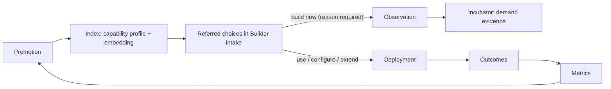

# Paul OS Phase 2 Plan — Quiet Console, Plugin System, Reuse Loop, Workstation Distribution

Follows completion of the Phase 1 conversion (the revised M-series). Incorporates the three locked decisions: numbered dirs are a **content tree with few code packages**, approvals are **scoped authority envelopes**, and the **daily briefing** is the proving workflow. Phase 2 answers four problems in one design:

1. The console is functional but **too noisy to review** — surfacing must become decision-grade.
2. Connections (MCP servers, HTTP APIs, CLIs, DB connectors) should behave as **simple, uniform plugins**.
3. **Promoted agents must flow back into Agent Builder as referred choices**, closing the reuse-first loop the platform was founded on.
4. The end state is a tool **on every managed enterprise workstation from day one** — Phase 2 builds single-user but architects every seam for that rollout.

---

## Workstream 1 — The Quiet Console

### Diagnosis

The current console gives every fact equal visual weight: gate tables, spec sections, evidence rows, and statuses all compete. Governance platforms naturally produce evidence sprawl; the fix is not fewer facts but a **hierarchy of attention** enforced by contract, not by per-page taste.

### 1.1 One queue, three shelves

The home surface becomes a single review queue ("Attention"). Everything that wants Paul lands there, grouped on three shelves:

- **Decide** — blocking items: envelope grants, promotions, memory acceptance, incubator candidates. Purple. These are the only items in the product allowed to badge.
- **Degraded** — amber strip: failing plugins, stalled runs, breached thresholds. Icon + label, never color alone.
- **Digest** — everything informational, folded into one line ("34 runs · $2.10 · 2 promotions this week") and delivered in full through tomorrow's **daily briefing**. FYIs never badge, never toast, never interrupt.

**Global rule: nothing outside the queue may notify.** The platform's telemetry reports to Paul through the same pipe his agents use — the briefing agent is the digest channel. The platform is its own first customer.

### 1.2 Summary contract: L0–L3 progressive disclosure

Add a `summary` block to the common resource envelope so every resource can render at four zoom levels without bespoke UI:

```yaml
summary:
  headline: 'Challenger v0.9.2 passed 12/12 gates' # L1 — one line, verdict first
  delta: '+2 improved, 0 regressed vs champion v0.8.1' # what changed, not what is
  status: decide | degraded | nominal
  next_action: promote # the single primary action
  cost: { period: run, usd: 0.31 } # cost is a first-class review input
```

- **L0** — status dot in a list.
- **L1** — one-line card (headline + delta).
- **L2** — decision card: headline, delta, cost, scopes, one primary + one secondary action. Target: decidable in under 30 seconds.
- **L3** — full instrument view (existing detail pages, tables, raw evidence).

Because the renderer works off the contract, a new resource kind gets quiet, consistent surfacing for free — noise control by construction.

### 1.3 Verdict-first evidence

Invert every evidence view: verdict headline first, then **deltas only** ("what changed vs. champion: 3 cases, all improved"), full tables collapsed behind L3. Champion/challenger comparisons render as a diff, never as two full reports. Runs render as a **flight recorder**: phases with durations and cost, tool calls collapsed, raw event log last.

### 1.4 Console grammar (a protocol, in 07-protocols)

Write the design rules down as an enforceable protocol that both humans and code-generating sessions must consult when producing any console page:

1. One primary action per screen; one per card.
2. Cards are two lines at L1; tables never appear above the fold.
3. A number ships with a trend, a comparison, or a budget — or it doesn't ship.
4. Purple is decision; amber is degradation (+ icon and label); red is reserved for safety stops; green is silent (nominal states don't decorate).
5. Diffs over states: show what changed since the reviewer last looked.
6. Every surfaced item answers "why am I seeing this?" in one click (provenance already exists — expose it).
7. Motion per the existing instrument standard: 150ms–5s, transform/opacity only, reduced-motion honored.
8. Keyboard-first review: j/k navigate, a/r approve-reject, e expand. Clearing a queue should feel like a cockpit checklist.

Putting this in 07-protocols means the platform's own governance governs its own UI generation — any future AI-built page is checked against it.

### 1.5 Plain-language standard (the cold-read test)

Every critical screen is written for someone who has never seen the platform and isn't watching how it's built. The rules:

1. The first two lines answer three questions: what is this, what happened, what do you need to do.
2. Platform terms are labels, never load-bearing. The chip may say ENVELOPE; the sentence next to it must work without it: "Daily Briefing asks to run every morning without asking each time."
3. Short sentences — about 14 words. Verbs first. No passive voice. No acronym without expansion on first use per screen.
4. Numbers carry their meaning inline: "about $0.40 per run — $12.60 for the month," never a bare figure.
5. Every action states its consequence and its undo: "Lasts 30 days — revoke anytime." "One click restores the current version."
6. Where risk is the question, answer it directly: a read-only grant says "It can't send, write, or delete anything."

Enforcement uses the platform's own machinery: **screen copy is a governed, evaluated artifact.** A cold-read eval shows each screen's text — nothing else — to an evaluator with no platform context, which must answer (a) what the screen is for, (b) what happened, (c) what each button will do. A screen that fails doesn't ship. This is the litmus test for handing the console to any enterprise user on day one.

### 1.6 Empty state is the goal state

A cleared queue shows "All quiet," the last briefing time, and nothing else. The console's success metric is how little of it Paul needs to look at.

---

## Workstream 2 — Connections as Plugins

### 2.1 One manifest kind for every connection

MCP server, HTTP API, CLI, and database connector become one governed resource kind — `plugin` — in the content tree:

```yaml
kind: plugin
name: governed-warehouse
transport: db # mcp | http | cli | db
capabilities: # every capability is a typed tool
  - tool: table_preview
    effect: read
    schema: { ... }
  - tool: run_query
    effect: read
    limits: { maximum_bytes_billed: 10000000 }
auth: { env: [GOOGLE_CLOUD_PROJECT], mechanism: adc } # secret refs only, never values
health: { probe: dry_run, interval_s: 300 }
classification: internal # public | internal | restricted
owner: paul
```

Internally, everything is normalized to the **MCP shape** — a set of typed tools — so skills and agents see one tool interface regardless of transport. The existing connector boundary (timeouts, jittered retry, circuit breaker, short-TTL cache, fail-closed flags) generalizes into the plugin runtime rather than being rebuilt per connection.

### 2.2 Uniform lifecycle, uniform card

`discover → install → configure → health-check → grant`. Installing a plugin is dropping a manifest and setting env values — **zero code in core** is the acceptance test. Every plugin renders as the same card: status dot, transport chip, capability count, last used, scopes currently granted, cost this week. One pattern for everything, which is what makes the system legible at a glance.

### 2.3 Plugins × envelopes

Authority envelopes list their scopes **by plugin, in human terms**: "Mail — read only · Warehouse — 3 approved datasets, 10 MB billed cap · Web — fetch only." Plugins declare their worst case; envelopes narrow it. The approval card renders directly from these declarations, which is what makes a grant reviewable in 30 seconds.

### 2.4 Operational affordances

- **Health surface:** one row per plugin, degraded rows float up; healthy rows stay dim (green is silent).
- **Used-by:** each plugin lists the agents/skills that depend on it; a plugin a certified agent depends on cannot be removed without retiring or re-pinning the agent.
- **Kill switch:** per-plugin disable that fails closed mid-run (run pauses, surfaces on the Degraded shelf).
- **Plugin packs:** a named bundle of plugins + default scopes (e.g. "Operations pack: metrics, governed records, reference data — all read-only"). Packs are manifests in 06-business-domains, which is what that directory is _for_ — see Workstream 4.
- **Classification-aware:** restricted mode filters the visible plugin set by `classification`; the gateway seam from Phase 1 applies per-plugin.

---

## Workstream 3 — Promotion → Referred Choices

### 3.1 Close the loop the platform was founded on

The original concept ("82% match to Supplier Risk Analyst v2.3") is already on the home page as Suggested Agents. Phase 2 wires it to the real lifecycle: **promotion is what feeds the suggestion engine.**



On promotion, the release's capability profile (tasks, inputs/outputs, tools, domain) is extracted from its manifest and indexed — structured matching plus embedding similarity. Retirement removes it; deployed configurations of a retired agent get flagged.

### 3.2 The referred choice card

Builder intake shows referred choices **before any spec is created**. Each card, per the console grammar:

- **Trust chip** — certification state in one line: "Certified · 12/12 gates · corpus 240 · re-certified Aug 2." Never raw evidence tables in the intake flow.
- **Match as a delta, not a score** — three lines: _has_ (capabilities covering your request), _lacks_ (what your request adds), _offers_ (capabilities you didn't ask for). A bare percentage is noise; the delta is decision-grade.
- **Provenance** — owner, department, deployment count, success rate, cost/run.

### 3.3 Four actions, one nudge

Use as-is · **configure** (project overlay, no fork) · **extend** (fork with recorded lineage) · build new. Choosing "build new" while a >80% match exists requires a one-line reason — and that reason is captured as an **observation** feeding the incubator. Unmet-need signals accumulate as demand evidence instead of evaporating. The nudge is soft; the paved road is simply the easiest road.

### 3.4 Skills compose too

When no whole agent matches, the engine proposes composition: "70% assemblable from 4 certified skills." The library renders lineage as a family tree (forked-from, composed-of), not a flat list.

---

## Workstream 4 — On Every Managed Workstation

Phase 2 **builds single-user and architects for fleet**. Everything below is a design constraint now and a rollout later; nothing here blocks the personal platform.

### 4.1 Shape: thin client, shared control plane

The workstation app is a client — console, CLI, and the user's granted plugin connections. Registry, runtime, ledger, and evidence are a central control plane per org. **Paul OS is the degenerate case where client and control plane share one machine.** Getting this seam right (all client↔core traffic through the /v1 contracts, no direct DB access from the console) is the Phase 2 architectural requirement; it costs little now and is the entire transfer story.

### 4.2 Day one is a populated tool, not an empty one

First-run flow: SSO → department resolved from the directory → the department's **starter pack** provisions automatically:

- the department's referred agents (Workstream 3),
- the department's plugin pack, pre-scoped read-only (Workstream 2),
- a default envelope policy (what a consumer may self-approve),
- the department daily briefing, subscribed.

New hire's first fifteen minutes: see the three agents your department already trusts, approve your first envelope, get your first briefing tomorrow at 07:00. Starter packs are governed manifests in 06-business-domains — versioned, promoted, and auditable like everything else.

### 4.3 Minimal roles

Four roles, enforced at the control plane: **consumer** (run referred agents, self-approve within department envelope policy) · **builder** (author specs and candidates) · **owner** (promote, set department policy, own exceptions) · **admin** (platform, plugins, compliance mode). The actor/workspace fields kept in every Phase 1 contract are the hook; row-level security by department follows the platform pattern already proven in the schema design.

### 4.4 The platform ships itself

Distribution is managed install (MSI/Intune) with an update channel pinned to **certified releases of the platform itself** — the platform is agent zero, promoted through its own gates, rolled back through its own release pointers. Workstation mode defaults to restricted/gateway compliance posture; the plugin set filters by classification automatically.

### 4.5 Prove it with numbers leadership cares about

Org metrics land in 10-metrics from day one of rollout: weekly active users per department, **reuse rate** (referred-choice acceptance vs. build-new), time-to-first-approved-run for new hires, % of runs completing inside their envelope (zero-escalation rate), cost per department per week. A demo mode (seeded synthetic department data, extending the existing idempotent seeds) powers the leadership walkthrough safely.

---

## Implementation order

Dependencies are named by capability, not milestone number, so they survive renumbering in the revised Phase 1 plan.

| Phase                      | Delivers                                                                                                                                                                                                                         | Depends on                                                |
| -------------------------- | -------------------------------------------------------------------------------------------------------------------------------------------------------------------------------------------------------------------------------- | --------------------------------------------------------- |
| **P1 — Quiet console**     | Summary contract in the resource envelope; Attention queue with three shelves; verdict-first evidence + flight recorder; digest→briefing wiring; console grammar protocol; plain-language copy + cold-read eval; keyboard review | Common resource envelope; daily briefing running          |
| **P2 — Plugin system**     | `plugin` manifest kind; transport adapters (mcp/http/cli/db) normalized to tool sets; plugin cards + health surface; scopes rendered into envelope cards; kill switch; used-by protection                                        | Registry/compiler; envelope approvals; provider/tool seam |
| **P3 — Reuse loop**        | Promotion-triggered indexing; referred choices in intake (trust chip, delta match); configure/extend/lineage; build-new reason → observation; skill composition suggestions                                                      | Promotion lifecycle; incubator observations               |
| **P4 — Workstation-ready** | Client/control-plane seam hardening; four roles + department RLS; starter-pack manifest kind; managed-install + self-release channel; demo mode; adoption metrics; leadership demo pack                                          | P1–P3                                                     |

P1 comes first because the summary contract is the layer everything else renders through — plugins, referred choices, and envelope cards all inherit quiet surfacing from it.

## Test and acceptance plan

**Quiet console**

- Every pending decision is reachable in ≤2 clicks from home; each decision card is decidable from its L2 rendering alone (usability check: clear a 5-item queue in under 3 minutes, keyboard only).
- The Attention queue is the only badge source in the product; FYI events produce no badge and appear in the next briefing.
- No table renders above the fold on any route; champion/challenger views show deltas with full evidence collapsed.
- Every surfaced card answers "why am I seeing this?" with provenance in one click.
- Cold-read eval passes on every critical screen: a context-free evaluator, shown only the screen's text, correctly states its purpose, what happened, and what each button does. A failing screen blocks merge.
- No sentence on a decision card exceeds ~16 words; platform vocabulary appears only in chips and labels, never as the load-bearing explanation.
- Reduced motion honored on all new surfaces; existing Playwright smoke checks extended to the queue.

**Plugins**

- Adding a new HTTP API requires only a manifest + env config — zero code changes in core packages.
- All four transports render through the identical card component; a failed health probe shows amber within 60 seconds; a killed plugin fails closed mid-run and surfaces on Degraded.
- A plugin with certified dependents cannot be uninstalled without retire/re-pin; envelope cards render scopes from plugin declarations verbatim.

**Reuse loop**

- A promotion appears in referred choices within one index cycle; retirement removes it and flags deployed configs.
- Intake shows referred choices before spec creation; "build new" over a >80% match requires a reason; that reason exists as an observation afterward.
- Match cards show has/lacks/offers deltas; no raw evidence tables appear in intake.

**Workstation**

- Console and CLI reach core exclusively through /v1 contracts (verified by network assertion in tests) — no direct DB path.
- Fresh environment → SSO stub → starter pack → first self-approved run in ≤15 minutes without documentation.
- The platform's own update ships as a certified release bundle and rolls back via release pointers.
- Demo mode seeds a synthetic department end to end; single-user local mode (Paul OS) still runs the full loop unchanged.

## Assumptions

- Phase 1 (revised M-series) is complete through promotion and envelopes before P3/P4 begin; P1 can start once the resource envelope and briefing exist.
- Phase 2 remains single-user in build; multi-user (SSO, roles, RLS) is designed and seamed in P4 but activated only in an approved enterprise deployment with its governed gateway.
- The public personal repository keeps synthetic data; department packs with real organizational content live only in the private deployment's content tree.
- The rebrand from Phase 1 holds: the personal instance and public repository carry neutral Paul OS identity; private deployments may apply organization-specific identity through the same design system.
- Plugin secrets remain env/secret-manager references; manifests and logs never contain values.
