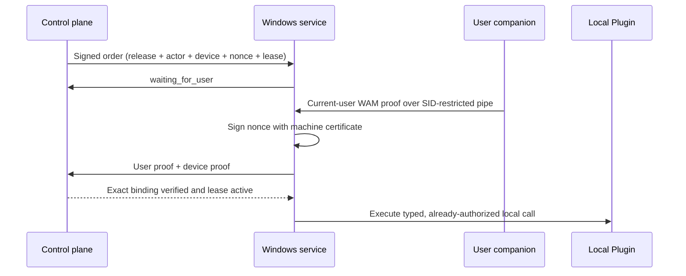

# Workstation Broker Proposal Status

## Delivered boundary

The repository now contains a neutral, synthetic Windows broker prototype under `apps/workstation-broker`. It proves the hard-to-retrofit protocol rules without assuming access to corporate infrastructure.

The local fixture executes this sequence through separate Service and Companion processes, using a synthetic no-effect tool. The control-plane verification and real Plugin arrows remain production proposal seams; the checked-in production path refuses them because the corresponding server endpoints and enterprise credentials do not exist.

## State contract

- All control-plane requirements: `control_plane_ready`; workstation availability is irrelevant.
- At least one workstation requirement: `waiting_for_user`; Attention reason is “Waiting for you to sign in.”
- Exact current actor and required device arrive before expiry: `leased`; only then may an effect begin.
- Actor, SID, device, work-order, lease, nonce, signature, or freshness mismatch: rejected with no effect.
- Freshness expires: `expired`; no late work; one digest item keyed `workstation-expired:<runId>`.
- Daily Brief default freshness: 7,200 seconds.

The TypeScript contract is currently pure and persistence-free. A production activation must persist work orders, nonce consumption, Attention items, execution events, and digest outbox writes atomically in PostgreSQL.

## Activation prerequisites

| Dependency                      | External owner              | Proof required before activation                                            |
| ------------------------------- | --------------------------- | --------------------------------------------------------------------------- |
| Enterprise identity application | Identity team               | Issuer, audience, scopes, group mapping, consent, token validation runbook  |
| Managed machine certificate     | Endpoint team               | Non-exportable certificate profile, rotation, revocation, device binding    |
| Managed installer signing       | Endpoint/security teams     | Trusted code-signing chain, timestamping, update/supersedence policy        |
| Control-plane endpoint          | Platform team               | Signed order API, durable replay ledger, leases, cancellation, audit events |
| Approved model/tool gateway     | Platform/security teams     | Network route and restricted-mode policy tests                              |
| Workstation Plugin allowlist    | Plugin owners/security team | Exact binaries, hashes, typed schemas, effects, sandbox rules               |
| Managed rollout                 | Endpoint/change teams       | Pilot cohort, rollback, telemetry, support and incident ownership           |

No item above is simulated as production readiness.

## Threat-model summary

| Threat                           | Current mitigation                                          | Activation follow-up                                     |
| -------------------------------- | ----------------------------------------------------------- | -------------------------------------------------------- |
| Device-only unattended execution | Current-user proof is mandatory                             | Verify access token server-side for every order          |
| User proof replay                | Nonce, lease, signature, exact IDs, process replay store    | Durable unique nonce record and transactional consume    |
| Wrong workstation                | Exact certificate thumbprint and challenge signature        | Managed certificate attestation and revocation checks    |
| Local pipe impersonation         | Exact SID + LocalSystem DACL and signed application payload | Security review of service SID and pipe audit policy     |
| Late scheduled work              | Freshness expiry blocks effects; idempotent digest key      | Atomic expiry/digest outbox and schedule catch-up policy |
| Scope broadening                 | Exact release/entry/Plugin/tool/digest binding              | Revalidate authority and context digest at dispatch      |
| Secret disclosure                | No secret/model/DB fields; no token logging                 | Centralized redaction tests and secure telemetry schema  |
| Arbitrary command execution      | Default executor always refuses                             | Per-Plugin signed binaries and effect-specific sandbox   |

## Review evidence

- Shared Zod contract and pure transition tests run credential-free.
- .NET Release build treats warnings as errors.
- Windows tests cover placement, dual identity, mismatch, replay, expiry, signed-payload tampering, ephemeral development certificate proof, and the named-pipe DACL.
- Integration tests launch the actual Service and Companion processes, observe `waiting_for_user → leased → completed`, prove replay rejection, and prove expiry emits one digest key with no companion or late effect.
- Kiota CLI and runtime dependencies are exact-pinned; generated output carries `kiota-lock.json`.
- The WiX proposal MSI is unsigned and labeled accordingly.
